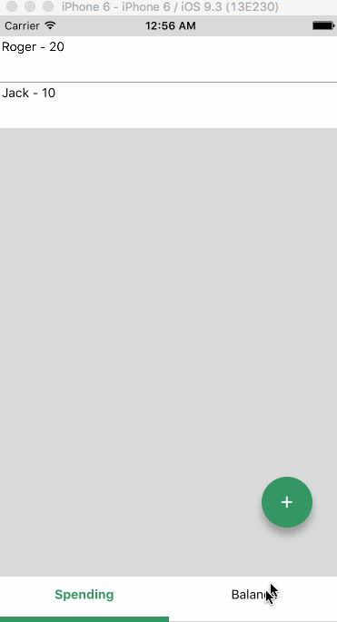

# gBudget

This is a simple app for balancing a group budget. It's destined to put on the app store or anything; it's rather a playgroud for trying out React Native.

## Demo

  

## Rebalancing algorithm

1. Calculate the total spending person
2. Calculate the average total spending
3. Calculate the difference between each person's total spending and the average total spending
4. While the differences are different than 0
    1. Find the person who has paid the most (the receiver)
    2. Find the person who has paid the least (the giver)
    3. Update each the receiver and the giver's differences with the lowest difference

Eventually the differences will all become 0 (there must be some proof out there). [Here](https://gist.github.com/MaxHalford/f233d0e5178847a273b357f3fd79a418) is the implementation in Python.
